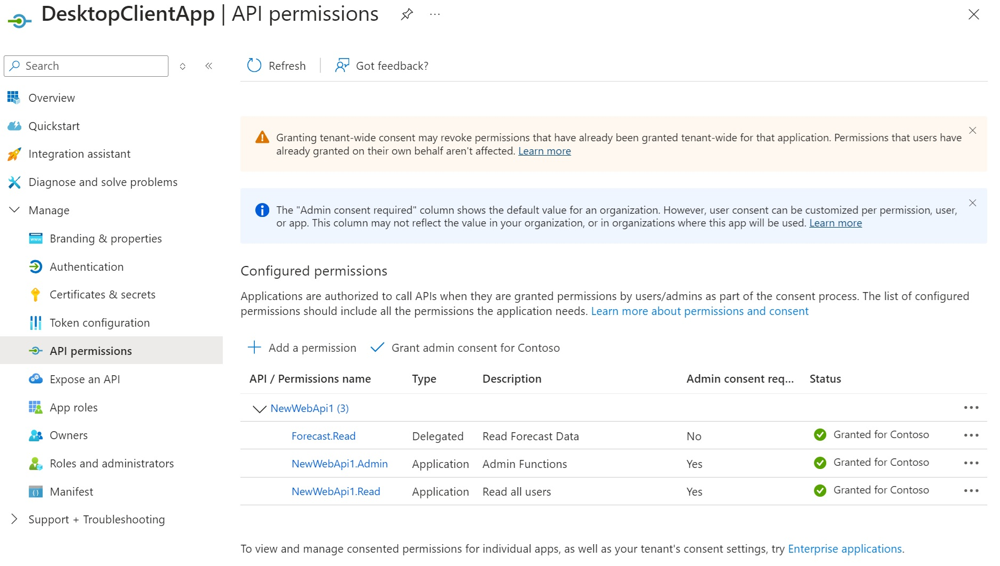

# Securing an REST API with Entra ID
This is a demo project to secure a simple REST API with Entra ID. The ProtectMe project implements a protected API and the connectme project implements how a client application can call the API. When running on a desktop, the client application will need to login interactively, but when running as an app or  service deployed to Azure (using Managed Identity) then once the right permissions have been setup for MI the app should be able to call the API without having to login.

## Setup Instructions

Setting up the App Registrations. In the tenant/subscription that will host the API we need an App Registration that describes the Api, scope and the Appliction (API) Roles. We also need a client application which represents the instance of the API. This project uses bicep to create and configure the app registrions. The script also creates a Service Principal for the API App allowing us to assign user/roles to the API

``` 
az deployment group create -g resourceGroupName --template-file .\protectme.bicep
```

Once the application is registered, you'll need to create the Service Principal for the `DesktopClientApp` and assign the roles using the **API Permissions** section. 



# User/Group Permissions

Using the **Enterprise Apps** setting, users can be assigned to the appropriate App roles to set the advanced permissions and user roles.

When the App authenticates a user, the expecting API roles are included in the token which can be verified using https://jwt.io

# API Management Template

To expose the API through API Management, see [backendPolicy.xml](/SecuringApi/ApimPolicy/backendPolicy.xml)

More information availale on the GitHub Azure Project repos

https://github.com/Azure/api-management-policy-snippets/blob/master/examples/Get%20OAuth2%20access%20token%20from%20AAD%20and%20forward%20it%20to%20the%20backend.policy.xml

